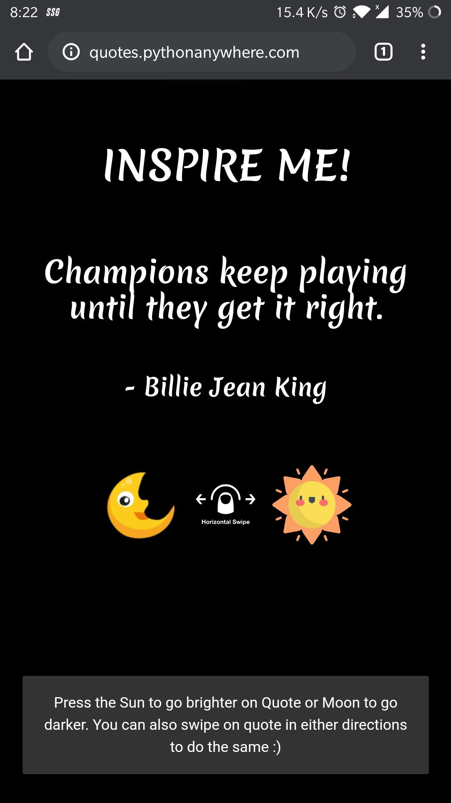

# Daily-Quotes - A sentiment-based Quoting Web Application

A Flask application that renders quotes based on analyzed sentiments of quotes data using the vader-sentiment-analyzer. One can navigate different quotes based on whether one wants a darker/deeper meaning quote or a motivational/brighter quote. The application is mainly made for mobile view effectively. 

### Main Features: 

* Mobile Friendly
* Sentiment based quote delivery
* Can add more quotes in the `quotes.csv` file by pasting the quote along with the author name

### Screenshot:

